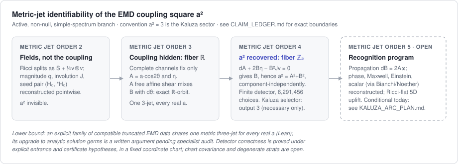

# Rainich--Kaluza reconstruction

[](https://github.com/jimpeebles/rainich-kaluza-reconstruction/actions/workflows/lean.yml)


Can a four-dimensional Lorentzian metric identify the coupling constant of
the theory it solves?  For Einstein--Maxwell--dilaton (EMD) gravity -- whose
distinguished value $a^2=3$ is exactly five-dimensional vacuum Kaluza
gravity in disguise -- this repository proves a sharp local answer on an
explicit active, non-null, simple-spectrum branch:

> **The metric three-jet cannot identify $a^2$; one further derivative
> can.**  The order-three ambiguity is exactly a free one-parameter shear
> group (a full $\mathbb R$ of couplings over one metric three-jet); at
> order four it collapses to the unavoidable sign $\mathbb Z_2$, and a
> finite metric-only detector recovers $a^2$ with compiled correctness
> theorems.  On an accepted Kaluza branch the necessary output is $3$ --
> necessary, not sufficient.



The finite-jet obstruction, the shear-fiber classification, the fourth-order
recovery, and the detector are machine-checked in Lean 4 over Mathlib.  The
upgrade of the obstruction from finite jets to analytic EMD solution germs is
a written formal-PDE argument -- an explicit involutivity extension of
Kruglikov's Einstein--Maxwell theorem -- pending independent specialist
audit, supported by an exact rational symbol/Cartan certificate.  Nothing
here is a new exact spacetime, a global theorem, or a converse uplift
criterion.

## Results at a glance

| Result | Evidence | Anchor |
|---|---|---|
| Complete first-channel fibers are exactly free affine shear orbits (order-three ambiguity $=\mathbb R$) | Lean (C1) | `canonicalFullComplexionCouplingChannels_eq_iff_shearOrbit` |
| One active formal metric three-jet supports compatible truncated EMD data for every real $a$, matter jet injective in $a$, simple Ricci spectrum | Lean (C2--C4) | `activeAmbiguity_commonFormalMetricThreeJet_for_every_coupling` |
| No function of that three-jet returns $a^2$ on the family | Lean (C6, finite part) | `no_couplingSquare_identifier_on_activeFormalMetricThreeJet` |
| Analytic solution-germ upgrade of the collision | Human + external, pending audit (C5) | `docs/ANALYTIC_EMD_REALIZATION.md` |
| Fourth-order recovery $a^2=A^2+B^2$, component-independent; family outputs agree iff $a=\pm b$ | Lean (C7) | `activeAmbiguityFourthOrderCouplingSqCandidates_eq_iff` |
| Finite metric-only detector: exactly 6,291,456 raw choices, correctness under explicit certificates, fixed-coordinate germ locality | Lean (C8--C10) | `allActualMetricDetectorChoices4_card`, `acceptedActualMetricFourthOrderCouplingSqValuesAt_eq_singleton_physical` |
| Kaluza reduction: 5D Ricci-flat $\iff$ convention EMD; selector $a^2=3$ necessary; conditional local uplift | Lean (C11--C12) | `intrinsicRicciFlatAt_iff_emd` |
| Exact-arithmetic oracles V1--V4 and the EMD symbol/Cartan certificate V5 | Exact symbolic | `validation/` |
| Kaluza recognition (converse) program: conditional pointwise fixed-choice endpoints compiled; invariant theorem open | In progress, no claims | `docs/KALUZA_ARC_PLAN.md` |

The authoritative statement of every claim, its exact boundary, and the
prohibited upgrades is [`docs/CLAIM_LEDGER.md`](docs/CLAIM_LEDGER.md).

## Evidence boundary

Machine-checked (Lean 4, Mathlib pinned, no `sorry`, no project axioms,
1,056-entry axiom audit): the shear-fiber classification; the active common
formal metric three-jet family with its Einstein/Maxwell/scalar/Hodge
truncated-equation certificates and first Ricci prolongation; realization of
the metric data by an actual cubic germ with genuine Frechet-derivative
Ricci; the finite-jet impossibility theorem; the fourth-order recovery and
its $a=\pm b$ fiber; the detector, its exact choice count, correctness
under displayed entrance/certificate hypotheses, and germ locality; the 5D
Ricci-block reduction and conditional uplift.

Not machine-checked: the analytic solution-germ realization (human proof
using Kruglikov's involutivity theorem; the single specialist-audit
dependency); full nonlinear-coordinate covariance of the detector; density
of the active locus; the null, repeated-root, and collision strata -- which
contain the textbook spherical solutions; any sufficiency of detector output
$3$ for a Kaluza uplift; and novelty, which remains "we are unaware of"
pending review.  The exact symbolic validation layer is reproducible
evidence, not proof.

## Start here

- Physicists: [`docs/OVERVIEW.md`](docs/OVERVIEW.md), then the
  [manuscript](papers/coupling-detector/MANUSCRIPT.md) and
  [technical supplement](papers/coupling-detector/TECHNICAL_SUPPLEMENT.md).
- Formalization auditors: [`docs/CLAIM_LEDGER.md`](docs/CLAIM_LEDGER.md),
  [`docs/ARCHITECTURE.md`](docs/ARCHITECTURE.md),
  [`docs/METHODOLOGY.md`](docs/METHODOLOGY.md), then the audit below.
- Formal-PDE specialists:
  [`docs/ANALYTIC_EMD_REALIZATION.md`](docs/ANALYTIC_EMD_REALIZATION.md)
  with the V5 certificate described in
  [`validation/README.md`](validation/README.md).
- Documentation map and precedence rules: [`docs/README.md`](docs/README.md).

## Reproduce

Install `elan`, then:

```sh
lake update
lake exe cache get
lake build
bash scripts/audit.sh
```

The audit builds with warnings treated as errors, rejects placeholders and
project axioms on the advertised theorem surface, and prints the axiom
dependencies of the headline Lean theorems.  Run the exact symbolic
validation separately (pinned Python/SymPy, no floating point, byte-pinned
artifacts):

```sh
cd validation
./audit.sh
```

## Repository map

- `RainichKaluza/` -- Lean library; layer map in
  [`docs/ARCHITECTURE.md`](docs/ARCHITECTURE.md).
- `papers/coupling-detector/` -- active paper and technical supplement.
- `validation/` -- pinned exact-symbolic benchmarks V1--V5.
- `docs/` -- claim ledger, plans, conventions, proof notes;
  archived history in `docs/archive/` and `papers/archive/`.

## Where this is going

The forward program -- a local, metric-only recognition theorem for the
Kaluza sector, with the Ricci-flat uplift delivered constructively -- is
specified with its own stop rules in
[`docs/KALUZA_ARC_PLAN.md`](docs/KALUZA_ARC_PLAN.md).  The project is
intended as a focused reconstruction theorem, not a new unified-field
proposal.  Priority language remains "we are unaware of" until specialists
in formal PDE, Rainich theory, and EMD geometry review the result.
