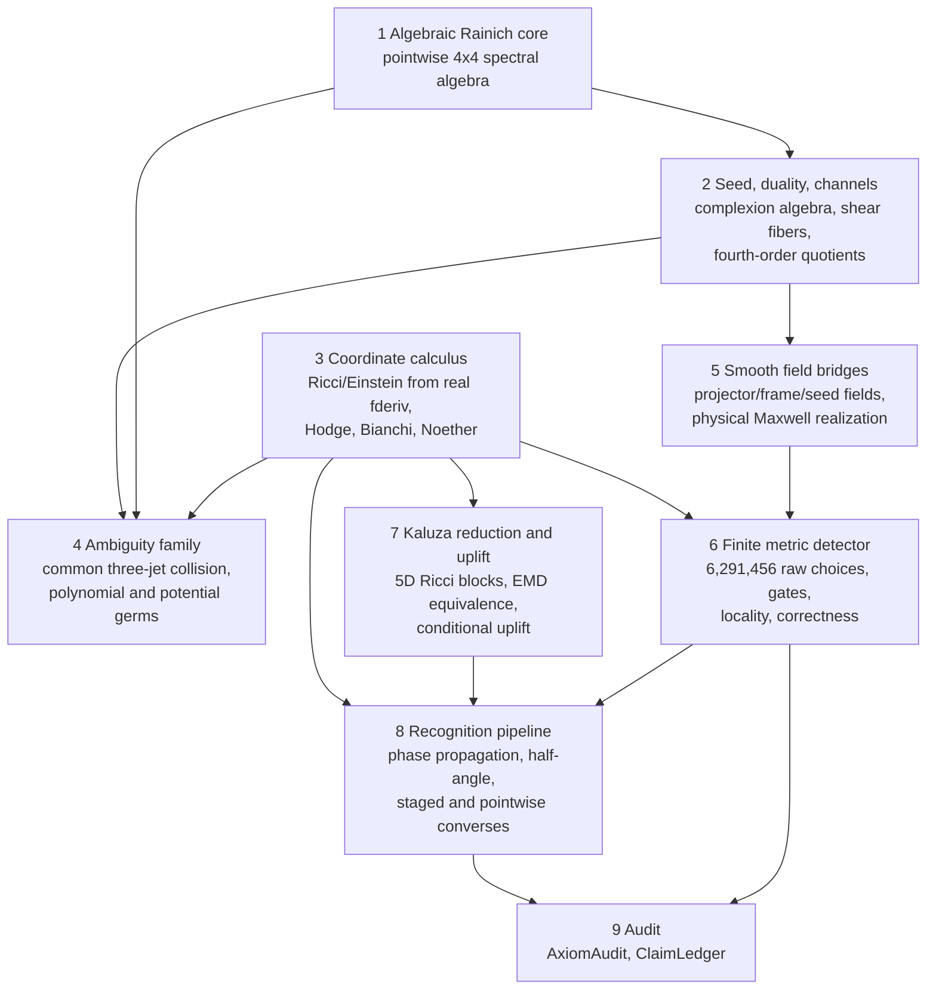

# Lean library architecture

Date: 2026-08-14

Status: navigation map for the `RainichKaluza/` library (~113 modules, flat
namespace).  Descriptive only; [`CLAIM_LEDGER.md`](CLAIM_LEDGER.md) governs
claims.  Modules are listed by layer, not alphabetically; the root import
list `RainichKaluza.lean` is the authoritative build order.

## Layer diagram

## Layers and modules

**1. Algebraic Rainich core** -- pointwise linear algebra on `Matrix4`:
characteristic data, protected eigenpairs, rank-one scalar blocks, the
reconstruction equation, and branch classification.
`CharacteristicData`, `AlgebraicFingerprint`, `RankOneEndomorphism`,
`ProtectedEigenspaces`, `ProtectedFactorization`, `AlgebraicEntrance`,
`GenericReconstruction`, `LorentzianScalarBlock`, `RelativeSignAmbiguity`,
`ReconstructionEquation`, `MaxwellResidual`, `MaxwellPrincipalProjectors`,
`PolynomialProjector`, `FullSpectralProjector`, `SpectralReflection`.

**2. Seed, duality, and coupling channels** -- the complexion covector,
duality orbits, the complete first-channel shear classification, and the
fourth-order quotient recovery.
`CanonicalMaxwellTwoForm`, `LocalExteriorSeed`, `ExteriorComplexion`,
`ComplexionCouplingSystem`, `MaxwellDualityOrbit`,
`DualityComplexionDerivative`, `CouplingInvariant`, `DifferentialCoupling`,
`DifferentialBranchSelection`, `ScalarAmplitudeDerivative`,
`SpectralProjectorDerivative`, `GeometricCouplingDetector`.

**3. Coordinate calculus** -- honest coordinate formulas driven by nested
Frechet derivatives: Ricci and its first jet, tensoriality, the Einstein
tensor with the normal-point contracted Bianchi identity, matter stress
divergences, the metric Hodge star, and the matrix-inverse chain rule.
`CoordinateRicci`, `CoordinateRicciFirstJet`, `AffineCoordinateRicci`,
`NonlinearCoordinateRicci`, `CoordinateRicciActualDerivative`,
`CoordinateRicciRegularity`, `CoordinateEinstein`,
`CoordinateEinsteinRegularity`, `MatterStressDivergence`, `MetricHodge`,
`MatrixInverseRegression`.

**4. Active ambiguity family** -- the explicit common metric-three-jet
collision, its equation certificates, the compiled impossibility theorem, and
genuine polynomial metric/potential realizations.
`ThirdOrderMatterJetAmbiguity`, `GenericActiveThirdOrderAmbiguity`,
`FiniteJetIdentifiabilityThreshold`, `MetricJetIdentifiabilityObstruction`,
`PolynomialMetricJetRealization`,
`ActiveAmbiguityPolynomialMetricNeighborhood`,
`ActiveAmbiguityPotentialTwoJet`, `ActiveAmbiguityPotentialPolynomial`,
`ActualPolynomialMetricRicci`, `ActualCoordinateRicciFirstJet`,
`RadialGaugePotential`, `RadialGaugePotentialTwoJet`, `RadialPotentialSplice`.

**5. Smooth field bridges (Phase III)** -- from pointwise algebra to actual
`C^k` fields: projector and frame fields, seed transport, and the physical
Maxwell realization used by correctness theorems.
`SmoothCurvatureProjector`, `SmoothMaxwellSeed`, `SmoothPrincipalPlaneFrame`,
`PrincipalPlaneFrame`, `LorentzFrameTransport`, `TransportedSeedDerivative`,
`CurvatureEigenOneFormDerivative`, `CurvatureScalarAmplitudeFieldDerivative`,
`CurvatureBranchObstruction`, `CurvatureBranchIntegration`,
`CurvatureKaluzaComposition`, `CurvatureScalarContribution`,
`PhaseIIIRescaledSeedRealization`, `PhaseIIITransportedSeedCalculus`,
`PhaseIIICurvaturePrincipalData`, `PhysicalMaxwellFieldRealization`,
`PhysicalComplexionInvariant`, `PhysicalScalarIdentifiability`.

**6. Finite metric detector** -- the metric-only fourth-order search:
choice enumeration and exact count, acceptance gates, germ locality,
four-jet factorization, and the invariant-EMD correctness spine.
`FourthOrderMetricDetector`, `ActualMetricDetectorChoiceCount`,
`ActualMetricDetectorLocality`, `ActualMetricDetectorRegularity`,
`ActualMetricScalarIdentifiability`, `MetricFourJetFactorization`,
`InvariantActiveWedge`, `InvariantActiveWedgeOpenness`,
`InvariantEMDConfluence`, `InvariantEMDDetectorComposition`,
`InvariantEMDEndToEnd`, `InvariantEMDRegularityEndToEnd`,
`InvariantEMDPhysicalActiveEndToEnd`, `InvariantEMDPublicationCorollaries`,
`NorthStarComposition`.

**7. Kaluza reduction and uplift** -- the 5D warped ansatz, derived Ricci
blocks, Ricci-flat iff EMD equivalences, chart-jet intrinsic versions, and
the conditional uplift with its presentation orbit.
`UpliftConvention`, `KaluzaBlockAssembly`, `KaluzaChristoffel`,
`KaluzaRicci`, `KaluzaRicciBase`, `KaluzaRicciMixed`,
`KaluzaFieldReduction`, `IntrinsicKaluzaLocal`, `KaluzaUpliftOrbit`,
`ConditionalKaluzaUplift`, `PhaseIVReadiness`.

**8. Recognition pipeline (arc program)** -- the K2 converse under
construction: coupling-circle propagation, half-angle charts, staged
Einstein/source and Hodge bridges, Noether-derived scalar equation, and the
conditional pointwise recognition endpoints.
`CouplingPhasePropagation`, `CouplingPhasePatch`,
`ActualMetricCouplingPhasePatch`, `LocalHalfAngleLift`,
`ActualMetricHalfAngleSplice`, `PhaseIIIChannelAcceptanceBridge`,
`StagedKaluzaConverse`, `StagedHodgeExteriorBridge`,
`StagedEinsteinSourceBridge`, `StagedEinsteinNormalGaugeBridge`,
`EinsteinSourceFirstJetBridge`, `CoreEinsteinSourceBridge`,
`CoreNormalScalarDerivation`, `CoreScalarResidualAlignment`,
`CoreSourceDerivedHodgeBridge`, `NormalEinsteinEquationBridge`,
`NormalGaugeEquationBridge`, `NormalMaxwellHodgeBridge`,
`NormalEMDScalarEquationBridge`, `NormalCoordinateHodgeFirstJet`,
`ScalarResidualFreeStagedKaluzaConverse`, `PointwiseCoreKaluzaRecognition`,
`SourceDerivedPointwiseKaluzaRecognition`, `FixedChoiceKaluzaRecognition`,
`GeometricFixedChoiceKaluzaRecognition`,
`ChartSpecificFixedChoiceKaluzaRecognition`.

**9. Audit** -- `AxiomAudit` (not imported by the root; run explicitly, 1,056
`#print axioms` entries) and `ClaimLedger` (named assumption slots).

## Conventions

Modules are flat by design; this map, not the filesystem, carries the layer
structure.  A planned consolidation of the layer-8 endpoint tower into one
canonical module is tracked in
[`KALUZA_ARC_PLAN.md`](KALUZA_ARC_PLAN.md) Section 11.  Layer boundaries are
one-directional: nothing in layers 1--7 imports layer 8.
